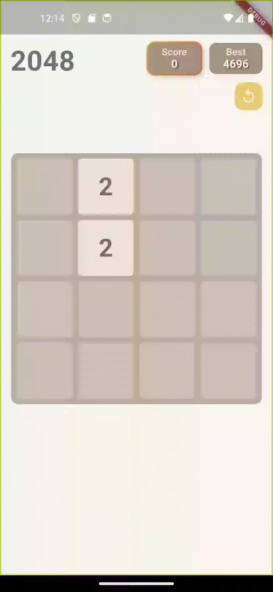
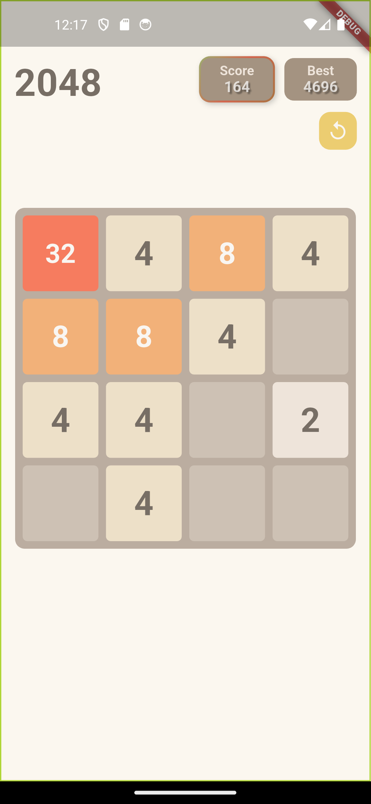
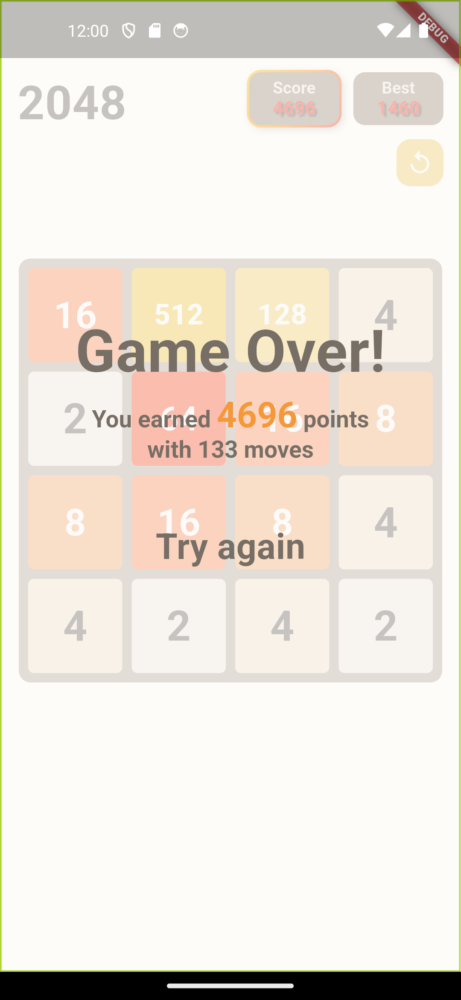

# 2048 game

A modern implementation of the classic 2048 puzzle game built with Flutter. This project enhances the traditional gameplay with smooth animations, an optimized algorithm, and persistent storage using `shared_preferences`.

## Features

-   **Smooth Animations**: Tiles slide and merge with visually appealing transitions.
-   **Optimized Algorithm**: Efficient logic for tile movement, merging, and game state management.
-   **Persistent Storage**: Save and load your high score and game state using `shared_preferences`.
-   **Responsive Design**: Works seamlessly on both Android and iOS devices.
-   **Customizable Styling**: Tile colors, text colors, font sizes, and weights adapt dynamically based on tile values

-   [Refer to the algorithm & animation](https://www.youtube.com/watch?v=QEqLobOif3Y)

<div style="display: flex; justify-content: space-between;">
    
    
    
</div>

## Installation

1. **Prerequisites**:

    - Flutter SDK installed (version 3.0.0 or higher recommended).
    - A code editor (e.g., VS Code, Android Studio).
    - An emulator or physical device for testing.

2. **Clone the Repository**:

    ```bash
    git clone https://github.com/Huando22222/2048.git
    cd 2048
    ```

3. **Install Dependencies and run the app**:
    ```bash
    flutter pub get
    flutter run
    ```
